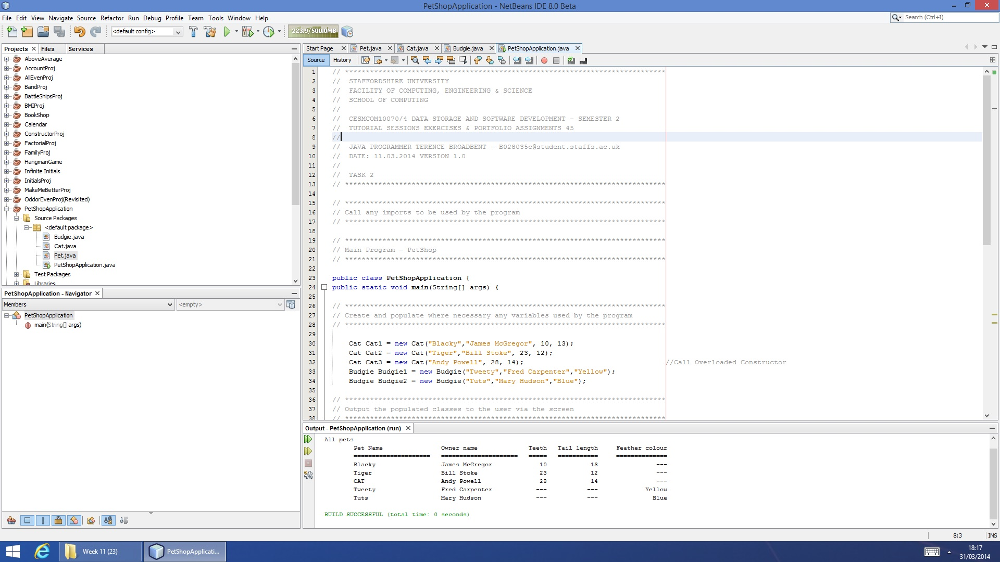

# PETSHOP 1
A pet shop animal/owner relationship utility file using inheritance.

| LANGUAGE | FILENAME | MD5 Hash |
|------    |------    | -------  |
| Java | PetShopApplication.java | e31c98d72670d501c0ec4498b0654ef2 |
| Java | Cat.java | 64602dfe178cebf9b4d11f45dfb711e4 |
| Java | Budgie.java | f2290019741bed831572d9f184f0af1f | 
| Java | Pet.java | d91574b8f7258adf834d870a510e48e4 | 

- [x] Tested and working...

## CONSOLE DISPLAY

